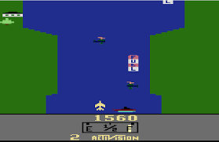

# River Raid

Um jogo feito com JavaScript, HTML e CSS.

## Sobre o Jogo

Essa releitura do jogo foi feita com o tema de Dragon Ball, onde o jogador controla o Goku e deve desviar das paredes para não morrer.

## Jogo Original

O jogo original foi feito em 1982 por [David Crane](<https://en.wikipedia.org/wiki/David_Crane_(video_game_designer)>) e [Greg Hopper](https://en.wikipedia.org/wiki/Greg_Hopper) para a Atari 2600.

## Sobre o projeto

O projeto foi feito para a disciplina de Tecnologias Web da Universiade Federal do Ceará. O roteiro do projeto pode ser encontrado [neste link](./docs/roteiro.md).

## Requisitos do projeto

- [x] O jogo consiste em uma nave que deverá passar por obstáculos.
- [x] A nave pode abastecer ao longo do percurso em postos de combustível que aparecem aleatoriamente no cenário do jogo.
- [x] A cada segundo que passa no jogo a nave perde uma unidade de energia, caso não seja feito um abastecimento antes que o combustível acabe o jogo termina.
- [x] Caso a nave encoste em algum obstáculo o jogo também termina.
- [x] A cada sequência de obstáculo vencido a nave ganha pontos.
- [x] A nave poderá pegar ao longo do jogo elementos. Esses elementos devem acrescentar pontos extras à nave.
- [x] No término do jogo deverá ser apresentada a pontuação final do jogador e quantas vezes o posto de combustível foi utilizado.

## Paleta de Cores

| **Código** | **Hex**   |  |
| ---------- | --------- | ------------------------------------------------------------------------------------- |
| Cinza      | `#8A9294` |                      |
| Preto      | `#252525` |                        |
| Magenta    | `#E59982` |                         |
| Bege       | `#FFD7C1` |                        |
| Azul       | `#072083` |                     |
| Laranja    | `#F85B1A` |                       |
