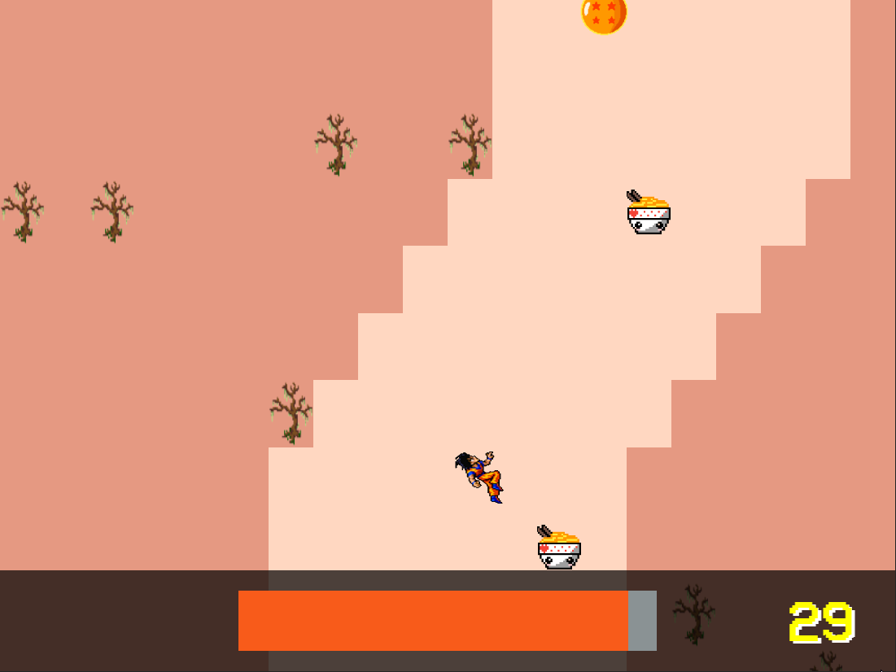
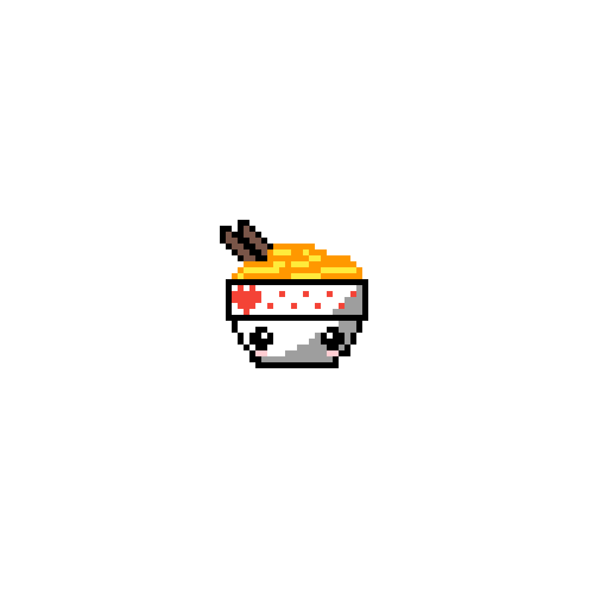
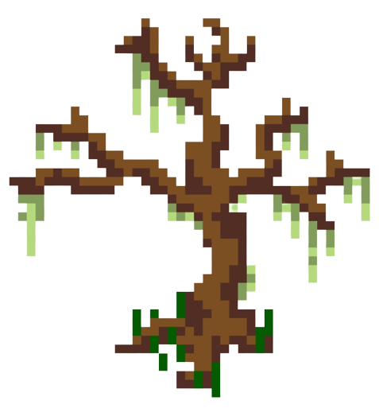

    </img>
    <h1>River Raid</h1>
    

          
        <a href="https://opensource.org/licenses/MIT">
            </img>
        </a>
    

    
Essa releitura do jogo River Raid do Atari tem como tema o mundo de Dragon Ball.

## Como jogar?

Basta [acessar o link](https://izaias.me/river-raid) e jogar!

O jogador controla o Goku e deve desviar das paredes e se manter alimentado para não morrer de cansaço.

A barra laranja representa a energia do Goku e em amarelo a pontuação. Para ganhar pontos, Goku deve capturar as Esferas do Dragão. Já para recuperar a energia, deve comer o Ramen. A cada nova fase, Goku ganha um ponto e a cada segundo ele perde uma unidade de energia.

## Sobre o projeto

O projeto foi feito para a disciplina de Tecnologias Web da Universidade Federal do Ceará. O roteiro do projeto pode ser encontrado [neste link](./docs/roteiro.md).

## Paleta de Cores

| **Código** | **Hex**   |  |
| ---------- | --------- | ------------------------------------------------------------------------------------- |
| Cinza      | `#8A9294` |                      |
| Preto      | `#252525` |                        |
| Magenta    | `#E59982` |                         |
| Bege       | `#FFD7C1` |                        |
| Azul       | `#072083` |                     |
| Laranja    | `#F85B1A` |                       |

## Entidades

As seguintes imagens representam as entidades do jogo:

| Elemento         | Imagem                                                |
| ---------------- | ----------------------------------------------------- |
| Goku             | </img>        |
| Ramen            | </img>       |
| Esfera do Dragão | </img> |
| Árvore Morta     | </img>   |

## Requisitos do projeto

- [x] O jogo consiste em uma nave que deverá passar por obstáculos.
- [x] A nave pode abastecer ao longo do percurso em postos de combustível que aparecem aleatoriamente no cenário do jogo.
- [x] A cada segundo que passa no jogo a nave perde uma unidade de energia, caso não seja feito um abastecimento antes que o combustível acabe o jogo termina.
- [x] Caso a nave encoste em algum obstáculo o jogo também termina.
- [x] A cada sequência de obstáculo vencido a nave ganha pontos.
- [x] A nave poderá pegar ao longo do jogo elementos. Esses elementos devem acrescentar pontos extras à nave.
- [x] No término do jogo deverá ser apresentada a pontuação final do jogador e quantas vezes o posto de combustível foi utilizado.

## Autor

| [ @izaiasmachado](https://github.com/izaiasmachado) |
| :---------------------------------------------------------------------------------------------------------------------------------------------------------------------------------: |
